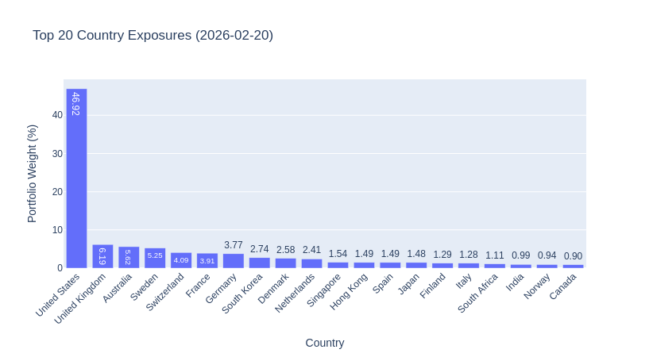
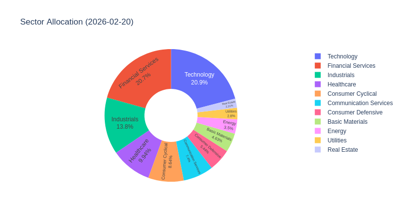
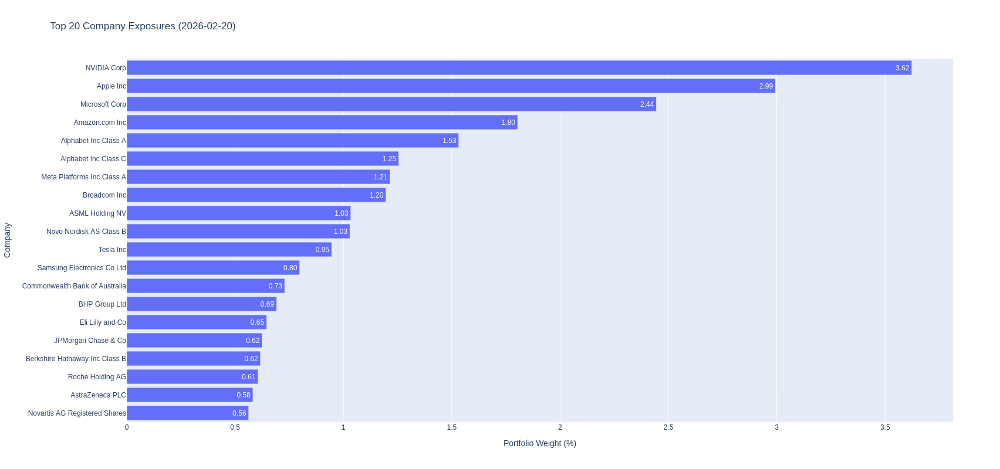

# ETF Portfolio Analyzer

A Python tool that provides transparency into the underlying holdings of an ETF-based investment portfolio. Since ETFs are composed of hundreds or thousands of individual securities, it can be difficult to understand real exposure at the country, sector, or company level, especially across multiple funds. This project solves that by fetching holdings data from Morningstar, combining it with actual portfolio market values, and producing an interactive dashboard that breaks down aggregate exposures.

## Dashboard Screenshots

### Country Exposure


### Sector Allocation


### Top Company Exposures


## How It Works

The project follows a three-stage pipeline:

1. **Data Extraction** — Pull the latest holdings data for each ETF from Morningstar via the [`mstarpy`](https://github.com/Mael-J/mstarpy) library and cache it locally.
2. **Exposure Calculation** — Combine cached holdings with actual portfolio market values to compute weighted exposure by country, sector, and individual company.
3. **Visualization** — Serve an interactive Dash dashboard that displays the computed exposures with a dropdown to compare across different portfolio snapshots over time.

## Project Structure

```
etf-analyzer/
├── scripts/
│   ├── extract_holdings_data.py   # Stage 1: Fetch & cache holdings from Morningstar
│   ├── holdings_analysis.py       # Stage 2: Calculate weighted exposures
│   ├── dashboard.py               # Stage 3: Interactive Plotly Dash dashboard
│   └── util_funcs.py              # Shared helpers (slugify, rate-limiting, etc.)
├── portfolio-data/
│   ├── funds_list.csv             # Master list of ETFs with ISINs, tickers, slugs
│   └── <YYYY-MM>/                 # Grouped by mstar cache extraction period
│       └── <YYYY-MM-DD>/          # Portfolio snapshot ("tag") date
│           └── <date>_portfolio.csv
├── mstar-data-cache/
│   └── <YYYY-MM>/                 # Cached holdings CSVs from Morningstar
├── processed_data/
│   └── <YYYY-MM-DD>/              # Computed exposure CSVs per snapshot
│       ├── exposure_country.csv
│       ├── exposure_sector.csv
│       └── exposure_company.csv
├── notebooks/
│   └── quick_query.ipynb          # Ad-hoc data exploration notebook
├── img/                           # Dashboard screenshots
├── requirements.txt
└── README.md
```

## Setup

```bash
python -m venv venv
source venv/bin/activate
pip install -r requirements.txt
```

Key dependencies: `mstarpy`, `pandas`, `dash`, `plotly`

## Usage

### 1. Define the portfolio

List the ETFs in `portfolio-data/funds_list.csv` with their ISINs, tickers, slugs, and any alternative search terms used for Morningstar lookups:

| Column | Purpose |
|---|---|
| Fund name | Display name |
| Slug | Filename-safe identifier (used for caching) |
| ISIN | Primary identifier for Morningstar search |
| Ticker | Fallback search term |
| Tracked index | Another fallback search term |
| Alternative ISINs | Comma-separated additional ISINs to try |
| Additional terms | Pipe-separated extra search terms |

Place portfolio market-value snapshots as CSV files under `portfolio-data/<YYYY-MM>/<YYYY-MM-DD>/`. The CSV must contain an `ISIN` column and a column with "Market Value in Account" in its header.

### 2. Extract holdings data

```bash
python scripts/extract_holdings_data.py
```

This fetches holdings for each fund from Morningstar (trying ISIN, ticker, and alternative terms in order) and caches the results in `mstar-data-cache/<YYYY-MM>/`. Previously cached funds are skipped automatically. A staleness warning is printed if the extraction period is more than 3 months old.

### 3. Calculate exposures

```bash
python scripts/holdings_analysis.py
```

For each portfolio snapshot, the script:
- Loads market values and merges with the funds metadata to resolve slugs
- Reads cached holdings for each fund, filtering to equity positions only
- Weights each underlying security by the fund's share of total portfolio value
- Aggregates by country, sector, and company and writes sorted CSVs to `processed_data/<YYYY-MM-DD>/`

### 4. Launch the dashboard

```bash
python scripts/dashboard.py
```

Opens an interactive Dash app at `http://127.0.0.1:8050/` featuring:
- **Dropdown selector** to switch between portfolio snapshot dates
- **Bar chart** of top 20 country exposures
- **Donut chart** of sector allocation
- **Horizontal bar chart** of top 20 company exposures

All charts update dynamically when a different snapshot is selected.

## Appendix: Extracting Transactions from Scalable Capital

Scalable Capital does not offer a CSV export for transactions. The following browser console script scrapes the transactions page and downloads them as a CSV, which can then be used to produce the portfolio snapshot files consumed by this project.

**Steps:**

1. Open your [Scalable Capital](https://scalable.capital/) transactions page.
2. Scroll down until all the transactions you want to analyze are loaded.
3. Open Developer Tools (`F12` or `Ctrl+Shift+I` / `Cmd+Option+I`) and go to the **Console** tab.
4. Paste the script below and press **Enter**. A CSV file will be downloaded automatically.

<details>
<summary>Browser console script (click to expand)</summary>

```js
(function extractScalableTransactions() {
    const transactions = [];
    const items = document.querySelectorAll('li[class*="-listItem"]');

    // HELPER: Find specific elements but strictly ignore "Container" wrappers
    const findNode = (parent, classNamePart) => {
        return Array.from(parent.querySelectorAll('*')).find(el => 
            el.className && 
            typeof el.className === 'string' && 
            el.className.includes(classNamePart) && 
            !el.className.includes('Container')
        );
    };

    items.forEach(item => {
        const button = item.querySelector('button');
        if (!button) return;

        // 1. Date and Status
        const ariaLabel = button.getAttribute('aria-labelledby') || '';
        const dateString = ariaLabel.split(': ')[0];
        const testId = button.getAttribute('data-testid') || '';
        const status = testId.includes('PENDING') ? 'Pending' : 'Settled';

        // 2. Type (Buy, Savings Plan, Deposit)
        const typeNode = findNode(item, '-type');
        const type = typeNode ? typeNode.innerText.trim() : 'Unknown';

        // 3. Name and ISIN
        let name = '';
        let isin = '';
        const linkNode = item.querySelector('a[href*="isin="]');
        
        if (linkNode) {
            name = linkNode.innerText.trim();
            const urlParams = new URLSearchParams(linkNode.getAttribute('href').split('?')[1]);
            isin = urlParams.get('isin') || '';
        } else {
            const descNode = findNode(item, '-description');
            if (descNode) name = descNode.innerText.trim();
        }

        // 4. Shares
        let shares = '';
        const sharesNode = findNode(item, '-numberOfShares');
        if (sharesNode) {
            const sharesText = sharesNode.innerText.replace(/[^\d.]/g, '');
            shares = parseFloat(sharesText) || 0;
        }

        // 5. Amount
        let amount = '';
        const statusNode = findNode(item, '-currentStatus');
        if (statusNode) {
            const statusText = statusNode.innerText.trim();
            if (statusText !== 'Pending') {
                const cleanAmount = statusText.replace(/[^\d.-]/g, '');
                amount = parseFloat(cleanAmount) || 0;
            }
        }

        transactions.push({
            Date: dateString,
            Status: status,
            Type: type,
            Name: name,
            ISIN: isin,
            Shares: shares,
            Amount: amount
        });
    });

    if (transactions.length === 0) {
        console.warn("No transactions found.");
        return;
    }

    // --- Convert to CSV ---
    const headers = ["Date", "Status", "Type", "Name", "ISIN", "Shares", "Amount"];
    const csvRows = [headers.join(',')];

    transactions.forEach(t => {
        const row = [
            t.Date,
            t.Status,
            t.Type,
            `"${t.Name}"`,
            t.ISIN,
            t.Shares,
            t.Amount
        ];
        csvRows.push(row.join(','));
    });

    const csvString = csvRows.join('\n');
    const blob = new Blob([csvString], { type: 'text/csv;charset=utf-8;' });
    const link = document.createElement("a");
    const url = URL.createObjectURL(blob);
    
    link.setAttribute("href", url);
    link.setAttribute("download", `scalable_transactions_${new Date().toISOString().split('T')[0]}.csv`);
    link.style.visibility = 'hidden';
    document.body.appendChild(link);
    link.click();
    document.body.removeChild(link);

    console.log(`Successfully extracted ${transactions.length} transactions!`);
})();
```

</details>

The downloaded CSV contains columns: `Date`, `Status`, `Type`, `Name`, `ISIN`, `Shares`, `Amount`.

## Tech Stack

| Component | Technology |
|---|---|
| Data extraction | `mstarpy` (Morningstar API wrapper) |
| Data processing | `pandas` |
| Dashboard | `Dash` + `Plotly` |
| Ad-hoc analysis | Jupyter Notebook |
